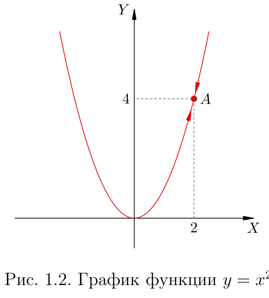
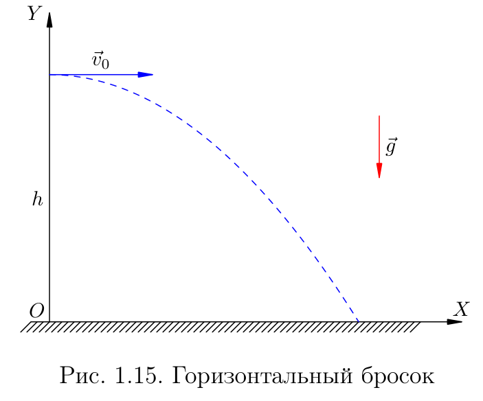
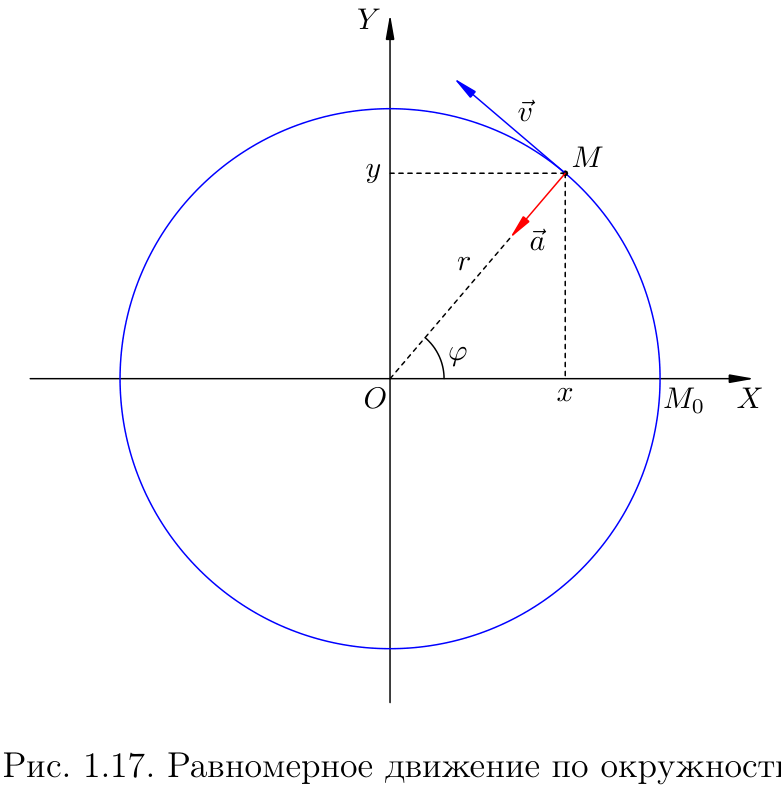
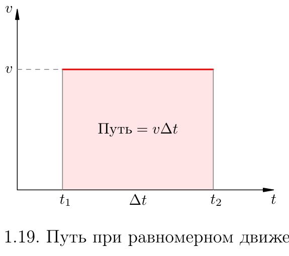
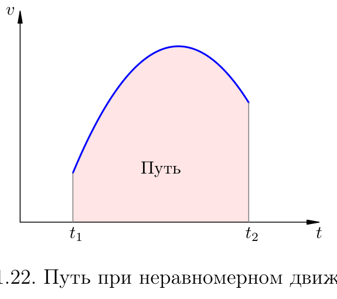
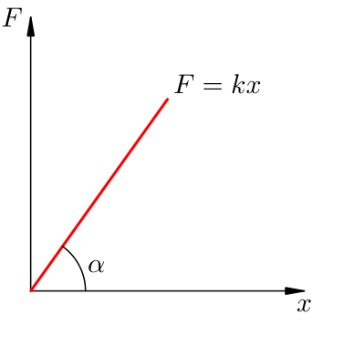
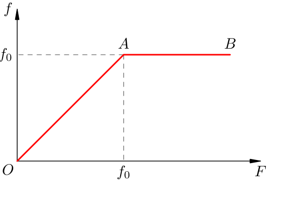
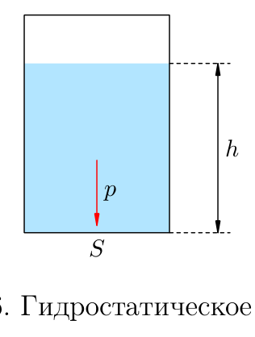
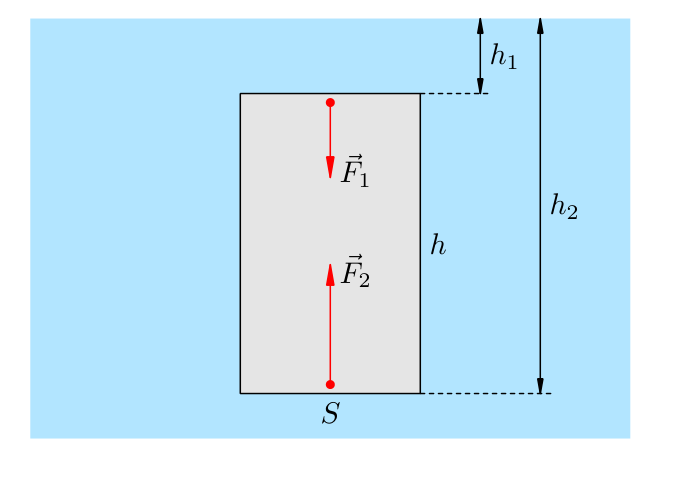
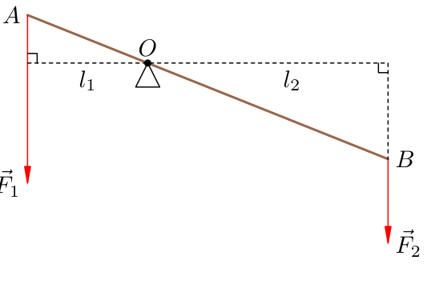

# Глава 1. Механика / Mechanics

> Основные понятия и законы школьного курса физики. Определения переформулированы
> (EN — по-английски в духе учебной литературы, RU — русский перевод), формулы
> соответствуют пособию, к каждому закону указан автор и его работа.
> Формулы и определения физики не охраняются авторским правом; текст пересказан.

---

## 1.1. Производная / Derivative

### Предел и мгновенная скорость / Limit and instantaneous velocity

Средняя скорость на малом промежутке переходит в мгновенную, когда промежуток
стремится к нулю. Это и есть производная — скорость изменения функции.

> **EN** The derivative of a function measures how fast the function changes as its
> argument changes; it is the limit of the average rate of change as the interval
> shrinks to zero.
>
> **RU** Производная характеризует скорость изменения функции: это предел отношения
> приращения функции к приращению аргумента, когда приращение аргумента стремится
> к нулю.

### Обозначения производной в физике / Notation in physics

В физике штрих зарезервирован, поэтому производную по времени обозначают точкой
над буквой: `ẋ(t)` — «икс с точкой», `ẍ(t)` — «икс с двумя точками».

> **EN** In physics the derivative with respect to time is written with a dot above
> the symbol (Newton's notation): `ẋ` for the first derivative, `ẍ` for the second.
>
> **RU** В физике производную по времени обозначают точкой над буквой: `ẋ` —
> первая производная, `ẍ` — вторая. Штрих зарезервирован для других целей.

**Связь с кинематикой:** скорость — производная координаты по времени; ускорение —
производная скорости по времени.

---

## 1.2. Механическое движение / Mechanical motion

### Относительность движения / Relativity of motion

> **EN** Motion is always relative: it is described with respect to a chosen frame of
> reference (the reference frame). There is no absolute rest.
>
> **RU** Движение относительно: оно описывается относительно выбранной системы
> отсчёта. Абсолютного покоя не существует.

### Материальная точка / Material point

> **EN** A material point is a body whose size can be neglected in the problem at hand.
>
> **RU** Материальная точка — тело, размерами которого в данной задаче можно пренебречь.

### Траектория, путь, перемещение / Trajectory, path, displacement

- **Траектория** — линия, по которой движется тело.
- **Путь** — длина траектории; всегда неотрицателен.
- **Перемещение** — вектор, соединяющий начальное и конечное положение; может быть
  равен нулю.

### Скорость / Velocity

$$v = \frac{s}{t}$$

> **EN** Velocity is the rate of change of position. For uniform straight-line motion
> it is the path divided by the time.
>
> **RU** Скорость — быстрота изменения положения. При равномерном прямолинейном
> движении она равна отношению пути ко времени.

### Ускорение / Acceleration

$$a = \frac{\Delta v}{\Delta t}$$

> **EN** Acceleration is the rate of change of velocity: the change in velocity divided
> by the time interval.
>
> **RU** Ускорение — быстрота изменения скорости: отношение изменения скорости
> к промежутку времени.

### Закон сложения скоростей / Addition of velocities

> **EN** The velocity of a body relative to a fixed frame equals its velocity relative
> to a moving frame plus the velocity of the moving frame itself.
>
> **RU** Скорость тела относительно неподвижной системы равна сумме его скорости
> относительно подвижной системы и скорости самой подвижной системы.

### Виды механического движения / Kinds of motion

Равномерное, равноускоренное, движение по окружности, свободное падение, бросок
под углом к горизонту.

---

## 1.3–1.4. Равномерное и равноускоренное движение / Uniform and uniformly accelerated motion

### Закон движения / Law of motion

$$x = x_0 + vt$$

$$x = x_0 + v_0 t + \frac{at^2}{2}$$

> **EN** The law of motion gives the position as a function of time. For uniform
> motion position grows linearly; for uniformly accelerated motion it grows quadratically.
>
> **RU** Закон движения задаёт положение как функцию времени. При равномерном
> движении координата растёт линейно, при равноускоренном — квадратично.

### Свободное падение / Free fall

$$g \approx 9{,}8\ \text{м/с}^2$$

> **EN** Free fall is motion under gravity alone. Near the Earth's surface all bodies
> fall with the same acceleration `g`, independent of their mass.
>
> **RU** Свободное падение — движение только под действием силы тяжести. Вблизи
> поверхности Земли все тела падают с одинаковым ускорением `g`, не зависящим от массы.

---

## 1.5. Равномерное движение по окружности / Uniform circular motion

### Угловая скорость / Angular velocity

$$\omega = \frac{\Delta\varphi}{\Delta t}$$

Связь с линейной скоростью: $v = \omega R$.

### Период и частота / Period and frequency

$$T = \frac{t}{N}$$

$$\nu = \frac{N}{t}$$

### Центростремительное ускорение / Centripetal acceleration

$$a_{\text{цс}} = \frac{v^2}{R} = \omega^2 R$$

> **EN** Centripetal acceleration is the acceleration of a body moving uniformly on a
> circle. Although the speed is constant, the direction of the velocity changes, and
> this change produces an acceleration directed toward the centre of the circle.
>
> **RU** Центростремительное ускорение — ускорение тела при равномерном движении
> по окружности. Хотя модуль скорости постоянен, направление скорости меняется, и
> это изменение порождает ускорение, направленное к центру окружности.

---

## 1.6. Путь при неравномерном движении / Path under non-uniform motion

> **EN** The path travelled by a body during any motion equals the area under the graph
> of velocity versus time on the given time interval.
>
> **RU** Путь, пройденный телом при любом движении, равен площади под графиком
> зависимости скорости от времени на заданном промежутке времени.

---

## 1.7. Первый закон Ньютона / Newton's first law

> **EN** If no other bodies act on a body, it keeps its state of rest or of uniform
> straight-line motion. Such frames are called inertial. This property is called inertia.
>
> **RU** Если на тело не действуют другие тела, оно сохраняет состояние покоя или
> равномерного прямолинейного движения. Такие системы отсчёта называются
> инерциальными. Это свойство называется инерцией.

- **Автор:** Исаак Ньютон (Isaac Newton)
- **Труд:** «Математические начала натуральной философии» (Philosophiæ Naturalis
  Principia Mathematica, 1687).

### Принцип относительности Галилея / Galileo's principle of relativity

> **EN** All inertial frames are equivalent: mechanical laws are the same in each.
>
> **RU** Все инерциальные системы равноправны: механические законы в них одинаковы.

- **Автор:** Галилео Галилей (Galileo Galilei)
- **Труд:** «Диалог о двух главнейших системах мира» (Dialogo sopra i due massimi
  sistemi del mondo, 1632); «Беседы о двух новых науках» (Discorsi e dimostrazioni
  matematiche, 1638).

---

## 1.8. Масса и плотность / Mass and density

### Масса / Mass

> **EN** Mass is a measure of inertia: the greater the mass, the harder it is to change
> the body's motion.
>
> **RU** Масса — мера инерции: чем больше масса, тем труднее изменить движение тела.

### Плотность / Density

$$\rho = \frac{m}{V}$$

> **EN** Density is the mass per unit volume of a substance.
>
> **RU** Плотность — масса единицы объёма вещества.

---

## 1.9. Второй и третий законы Ньютона / Newton's second and third laws

### Принцип суперпозиции / Principle of superposition

> **EN** If several forces act on a body, they add as vectors; their sum is the
> resultant (net) force.
>
> **RU** Если на тело действует несколько сил, они складываются как векторы; их сумма
> называется равнодействующей силой.

### Второй закон / Second law

$$m\vec{a} = \vec{F}$$

> **EN** The product of mass and acceleration equals the resultant force acting on the
> body. In scalar form: `ma = F`.
>
> **RU** Произведение массы на ускорение равно равнодействующей силе. В скалярной
> форме: `ma = F`.

**Альтернативные записи / Alternative notations:**

$$F = ma$$
«равнодействующая сила равна массе, умноженной на ускорение»; И. В. Яковлев, «Физика» (MathUs.ru) — в пособии запись `ma = F`; форма `F = ma` более распространена в школьных учебниках (А. В. Перышкин).

$$\vec{F} = m\vec{a}$$
векторная форма; стандарт в вузовской литературе (И. Е. Иродов, «Механика»).

- **Автор:** Исаак Ньютон
- **Труд:** «Математические начала натуральной философии» (1687).

### Третий закон / Third law

> **EN** Two bodies act on each other with forces equal in magnitude and opposite in
> direction ("action equals reaction"). The forces have the same physical nature and
> lie along the line joining their points of application.
>
> **RU** Два тела действуют друг на друга с силами, равными по модулю и
> противоположными по направлению («действие равно противодействию»). Силы имеют
> одну природу и направлены вдоль прямой, соединяющей точки приложения.

---

## 1.10. Сила упругости / Elastic force (Hooke's law)

### Деформация / Deformation

> **EN** Deformation is a change of shape or size of a body.
>
> **RU** Деформация — изменение формы или размеров тела.

### Закон Гука / Hooke's law

$$F = kx$$

> **EN** The elastic force is directly proportional to the deformation. For a spring
> stretched or compressed by `x`, the elastic force is `F = kx`, where `k` is the
> stiffness.
>
> **RU** Сила упругости прямо пропорциональна деформации. Для пружины, растянутой
> или сжатой на `x`, сила упругости равна `F = kx`, где `k` — коэффициент жёсткости.

**Альтернативные записи / Alternative notations:**

$$F = -kx$$
векторная форма со знаком минус, указывающим, что сила направлена против смещения; И. Е. Иродов, «Механика».

$$F_{\text{упр}} = kx$$
с индексом, обозначающим именно силу упругости; встречается в задачниках и справочниках (О. Ф. Кабардин, «Физика. Справочник»).

- **Автор:** Роберт Гук (Robert Hooke)
- **Труд:** «De Potentia Restitutiva» (1678).

### Модуль Юнга / Young's modulus

$$F = \frac{ES\,x}{l}$$

> **EN** Young's modulus `E` characterises the material itself (not a particular spring)
> and does not depend on the geometric dimensions of the rod.
>
> **RU** Модуль Юнга `E` характеризует само вещество (а не конкретную пружину) и не
> зависит от геометрических размеров стержня.

**Альтернативные записи / Alternative notations:**

$$\sigma = E\varepsilon$$
через механическое напряжение $\sigma = F/S$ и относительную деформацию $\varepsilon = x/l$; стандартная форма в курсе сопротивления материалов и вузовской физике (И. Е. Иродов).

$$k = ES/l$$
коэффициент жёсткости стержня, выраженный через модуль Юнга; Г. Я. Мякишев, «Физика. 10 класс».

- **Автор:** Томас Юнг (Thomas Young)

---

## 1.11. Сила тяготения / Gravitational force

### Закон всемирного тяготения / Law of universal gravitation

$$F = G\frac{m_1 m_2}{r^2}$$

$$G = 6{,}67\cdot 10^{-11}\ \text{Н}\cdot\text{м}^2/\text{кг}^2$$

> **EN** Two point masses attract each other with a force proportional to the product
> of their masses and inversely proportional to the square of the distance between
> them. This is the inverse-square law.
>
> **RU** Две материальные точки притягиваются с силой, прямо пропорциональной
> произведению их масс и обратно пропорциональной квадрату расстояния между ними.
> Это закон обратных квадратов.

**Альтернативные записи / Alternative notations:**

$$F = \gamma\, m_1 m_2 / r^2$$
гравитационная постоянная обозначена греческой буквой `γ`; встречается в старой школьной литературе (А. В. Перышкин, издания до 2000-х) и в справочниках по физике.

$$\vec{F} = -G\, m_1 m_2 / r^2\, \hat{r}$$
векторная форма с единичным радиус-вектором `r̂`; стандарт в курсе механики (И. Е. Иродов).

- **Автор:** Исаак Ньютон
- **Труд:** «Математические начала натуральной философии» (1687).
- **Численное значение `G`** определено Генри Кавендишем (Henry Cavendish) в опыте 1798 г.

### Сила тяжести / Weight (force of gravity)

$$mg$$

> **EN** The force of gravity near the Earth's surface is the product of mass and the
> acceleration of free fall: `mg`, where `g ≈ 9.8 m/s²`.
>
> **RU** Сила тяжести вблизи поверхности Земли равна произведению массы на ускорение
> свободного падения: `mg`, где `g ≈ 9,8 м/с²`.

**Альтернативные записи / Alternative notations:**

$$F_{\text{т}} = mg$$
сила тяжести обозначается с индексом «т»; А. В. Перышкин, «Физика. 7 класс».

$$P = mg$$
в некоторых источниках вес тела и сила тяжести записываются одной буквой `P`, что может приводить к путанице; О. Ф. Кабардин, «Физика. Справочник».

### Вес тела / Weight of a body (the force on a support)

> **EN** The weight of a body is the force with which the body acts on the support or
> suspension. It is applied to the support, not to the body. Weight is measured in
> newtons, mass in kilograms.
>
> **RU** Вес тела — сила, с которой тело действует на опору или подвес. Вес приложен
> к опоре, а не к телу. Вес измеряется в ньютонах, масса — в килограммах.

### Невесомость / Weightlessness

> **EN** Weightlessness is a state in which the support does not act on the body and
> the weight is zero (free fall, an orbiting spacecraft).
>
> **RU** Невесомость — состояние, когда опора не действует на тело, и вес равен нулю
> (свободное падение, космический корабль на орбите).

### Искусственные спутники / Artificial satellites

> **EN** For a circular orbit the gravitational force provides the centripetal force.
>
> **RU** Для круговой орбиты сила тяготения играет роль центростремительной силы.

---

## 1.12. Сила трения / Friction

### Сухое трение / Dry friction

$$f = \mu N$$

> **EN** Dry friction (static and sliding) is proportional to the normal reaction force:
> `f = μN`, where `μ` is the dimensionless coefficient of friction determined by the
> pair of materials.
>
> **RU** Сухое трение (покоя и скольжения) пропорционально силе реакции опоры:
> `f = μN`, где `μ` — безразмерный коэффициент трения, определяемый парой материалов.

**Альтернативные записи / Alternative notations:**

$$F_{\text{тр}} = \mu N$$
сила трения обозначается с индексом «тр»; наиболее распространённая форма в школьных учебниках (А. В. Перышкин).

$$f = \mu N$$
строчная буква `f`; используется в пособии И. В. Яковлева и в вузовских курсах, чтобы отличать силу трения от других сил.

### Вязкое трение / Viscous friction

> **EN** Viscous friction occurs in liquids and gases and depends on the speed of the
> body rather than only on the pair of materials.
>
> **RU** Вязкое трение возникает в жидкостях и газах и зависит от скорости тела,
> а не только от пары материалов.

---

## 1.13. Статика твёрдого тела / Statics of a rigid body

### Момент силы / Torque (moment of force)

$$M = F\cdot l$$

> **EN** The torque of a force about an axis is the product of the force and the lever
> arm: `M = Fl`. It measures how effectively the force rotates the body.
>
> **RU** Момент силы относительно оси — произведение силы на плечо: `M = Fl`. Он
> показывает, насколько эффективно сила вращает тело.

### Условия равновесия / Conditions of equilibrium

> **EN** A rigid body is in equilibrium when the vector sum of all forces is zero and
> the sum of all torques is zero.
>
> **RU** Твёрдое тело находится в равновесии, когда векторная сумма всех сил равна
> нулю и сумма всех моментов сил равна нулю.

---

## 1.14. Статика жидкостей и газов / Statics of fluids

### Гидростатическое давление / Hydrostatic pressure

$$p = \rho g h$$

> **EN** Hydrostatic pressure at depth `h` in a fluid of density `ρ` is `p = ρgh`.
>
> **RU** Гидростатическое давление на глубине `h` в жидкости плотностью `ρ` равно
> `p = ρgh`.

### Закон Паскаля / Pascal's law

> **EN** The pressure applied to a liquid or gas is transmitted equally to every point
> of the medium and in all directions.
>
> **RU** Давление, оказываемое на жидкость или газ, передаётся в любую точку среды
> одинаково и во всех направлениях.

- **Автор:** Блез Паскаль (Blaise Pascal)

### Гидравлический пресс / Hydraulic press

$$\frac{F_2}{F_1} = \frac{S_2}{S_1}$$

> **EN** The forces on the pistons are proportional to their areas: pressing on the
> small piston with a small force lifts a heavy load on the large piston.
>
> **RU** Силы на поршни пропорциональны их площадям: нажимая с небольшой силой на
> малый поршень, поднимаем тяжёлый груз на большом поршне.

**Альтернативные записи / Alternative notations:**

$$F_1 / F_2 = S_1 / S_2$$
то же соотношение, записанное в обратном порядке; А. В. Перышкин, «Физика. 7 класс».

$$F_2 / F_1 = S_2 / S_1$$
отношение на большом поршне к малому; форма пособия И. В. Яковлева.

### Закон Архимеда / Archimedes' principle

$$F_{\text{А}} = \rho g V$$

> **EN** A body immersed in a liquid or gas experiences an upward buoyant force equal
> to the weight of the displaced fluid: `F_A = ρgV`, where `V` is the volume of the
> submerged part.
>
> **RU** На тело, погружённое в жидкость или газ, действует выталкивающая сила,
> равная весу вытесненной жидкости: `F_A = ρgV`, где `V` — объём погружённой части.

**Альтернативные записи / Alternative notations:**

$$F_{\text{А}} = \rho_{\text{ж}} g V_{\text{пт}}$$
с индексами «ж» (жидкость) и «пт» (погружённая часть); А. В. Перышкин, «Физика. 7 класс».

$$F_{\text{А}} = \rho g V$$
форма пособия И. В. Яковлева; `ρ` — плотность жидкости, `V` — объём погружённой части тела.

- **Автор:** Архимед (Archimedes)
- **Труд:** трактат «О плавающих телах» (On Floating Bodies).

### Плавание тел / Floating bodies

> **EN** A body floats when the buoyant force balances the force of gravity.
>
> **RU** Тело плавает, когда сила Архимеда уравновешивает силу тяжести.

---

## 1.15. Импульс / Momentum

### Импульс / Momentum

$$\vec{p} = m\vec{v}$$

> **EN** Momentum is the product of mass and velocity: `p = mv`. It is a measure of the
> amount of motion of a body.
>
> **RU** Импульс — произведение массы на скорость: `p = mv`. Это мера количества
> движения тела.

### Второй закон Ньютона в импульсной форме / Second law in momentum form

$$\vec{F} = \frac{\Delta \vec{p}}{\Delta t}$$

> **EN** The net force equals the rate of change of momentum.
>
> **RU** Равнодействующая сила равна скорости изменения импульса.

### Импульс системы тел / Momentum of a system of bodies

$$\vec{p} = \vec{p}_1 + \vec{p}_2 + \ldots + \vec{p}_N$$

> **EN** The momentum of a system is the vector sum of the momenta of all its bodies.
>
> **RU** Импульс системы тел — векторная сумма импульсов всех тел системы.

### Закон сохранения импульса / Conservation of momentum

> **EN** In a closed system the vector sum of the momenta of the bodies remains
> constant: it only redistributes between the bodies.
>
> **RU** В замкнутой системе векторная сумма импульсов тел сохраняется: она лишь
> перераспределяется между телами.

### Закон сохранения проекции импульса / Conservation of a momentum component

> **EN** If the projection of the external forces on an axis is zero, the projection of
> the momentum on that axis is conserved.
>
> **RU** Если проекция внешних сил на ось равна нулю, сохраняется проекция импульса
> на эту ось.

---

## 1.16. Энергия / Energy

### Работа / Work

$$A = Fs$$

> **EN** Work is the product of the force and the displacement along the force: `A = Fs`.
> It is positive if the body moves in the direction of the force and negative if it is
> slowed down.
>
> **RU** Работа — произведение силы на путь под её действием: `A = Fs`. Она
> положительна, если тело движется в направлении силы, и отрицательна, если
> замедляется.

**Альтернативные записи / Alternative notations:**

$$A = Fs\cos\alpha$$
общая форма, учитывающая угол $\alpha$ между силой и перемещением; А. В. Перышкин, «Физика. 7–9 класс» (также О. Ф. Кабардин).

$$A = \vec{F}\vec{s}$$
через скалярное произведение векторов силы и перемещения; И. Е. Иродов, «Механика».

### Мощность / Power

$$N = \frac{A}{t}$$

> **EN** Power is the rate of doing work: the work done per unit time.
>
> **RU** Мощность — скорость совершения работы: работа, совершаемая за единицу времени.

**Альтернативные записи / Alternative notations:**

$$P = A/t$$
мощность обозначается буквой `P`; А. В. Перышкин, «Физика. 7 класс» (самый распространённый школьный вариант).

$$N = A/t$$
мощность обозначается буквой `N`; пособие И. В. Яковлева и часть вузовских курсов. Важно не путать `P` (мощность) с весом `P`.

### Кинетическая энергия / Kinetic energy

$$K = \frac{mv^2}{2}$$

> **EN** Kinetic energy is the energy of motion: half the product of mass and the square
> of speed.
>
> **RU** Кинетическая энергия — энергия движения: половина произведения массы на
> квадрат скорости.

**Альтернативные записи / Alternative notations:**

$$E_{\text{к}} = mv^2/2$$
кинетическая энергия обозначается `E` с индексом «к»; А. В. Перышкин, «Физика. 7–9 класс».

$$K = mv^2/2$$
буква `K`; пособие И. В. Яковлева и вузовские курсы.

### Потенциальная энергия вблизи поверхности Земли / Potential energy near the Earth

$$W = mgh$$

> **EN** Potential energy near the Earth's surface is the "stored" energy: `W = mgh`,
> where the height is measured from the chosen zero level.
>
> **RU** Потенциальная энергия вблизи поверхности Земли — «запасённая» энергия:
> `W = mgh`, где высота отсчитывается от выбранного нулевого уровня.

**Альтернативные записи / Alternative notations:**

$$E_{\text{п}} = mgh$$
потенциальная энергия обозначается `E` с индексом «п»; А. В. Перышкин, «Физика. 7–9 класс».

$$W = mgh$$
буква `W`; пособие И. В. Яковлева и вузовские курсы (также обозначение $U$ — в некоторых зарубежных учебниках).

### Потенциальная энергия деформированной пружины / Spring potential energy

$$W = \frac{kx^2}{2}$$

### Закон сохранения механической энергии / Conservation of mechanical energy

> **EN** In a closed system where only conservative forces (gravity and elasticity) act,
> the total mechanical energy remains constant. Energy is not created or destroyed but
> changes from one form to another.
>
> **RU** В замкнутой системе, где действуют только консервативные силы (сила тяжести
> и сила упругости), полная механическая энергия остаётся постоянной. Энергия не
> исчезает, а переходит из одной формы в другую.

### Закон изменения механической энергии / Change of mechanical energy

> **EN** When non-conservative forces (such as friction) do work, the mechanical energy
> changes, turning into internal (thermal) energy.
>
> **RU** При работе неконсервативных сил (например, трения) механическая энергия
> меняется, превращаясь во внутреннюю (тепловую) энергию.

---

## 1.17. Простые механизмы / Simple machines

### Рычаг / Lever

$$F_1 l_1 = F_2 l_2$$

> **EN** A lever is in equilibrium when the product of force and lever arm is the same
> on both sides: `F₁l₁ = F₂l₂`. The forces are inversely proportional to the arms.
>
> **RU** Рычаг в равновесии, когда произведение силы на плечо одинаково с обеих
> сторон: `F₁l₁ = F₂l₂`. Силы обратно пропорциональны плечам.

### Неподвижный и подвижный блок / Fixed and movable pulleys

> **EN** A fixed pulley changes the direction of the force but gives no gain in force.
> A movable pulley gives a two-fold gain in force, but loses the same amount in distance.
>
> **RU** Неподвижный блок меняет направление силы, но не даёт выигрыша в силе.
> Подвижный блок даёт двукратный выигрыш в силе, но во столько же раз проигрывает
> в расстоянии.

### Наклонная плоскость / Inclined plane

$$F = mg\sin\alpha$$

> **EN** An inclined plane lets you lift a load with a smaller force, but over a longer
> distance.
>
> **RU** Наклонная плоскость позволяет поднять груз меньшей силой, но на большем пути.

### Золотое правило механики / Golden rule of mechanics

> **EN** No simple machine gives a gain in work. As many times as you gain in force,
> you lose in distance, and vice versa. This is a simple form of the law of conservation
> of energy.
>
> **RU** Ни один простой механизм не даёт выигрыша в работе. Во сколько раз выигрываем
> в силе, во столько же проигрываем в расстоянии, и наоборот. Это простой вариант
> закона сохранения энергии.

### КПД механизма / Efficiency

$$\eta = \frac{A_{\text{полезн}}}{A_{\text{полн}}}$$

> **EN** Efficiency is the ratio of useful work to total (input) work. It is always less
> than 100% because of losses to friction and heating.
>
> **RU** КПД — отношение полезной работы к полной (затраченной). Он всегда меньше
> 100% из-за потерь на трение и нагрев.

**Альтернативные записи / Alternative notations:**

$$\eta = A_{\text{полезн}} / A_{\text{затр}}$$
полная работа названа «затраченной»; А. В. Перышкин, «Физика. 7 класс».

$$\eta = A_{\text{полезн}} / A_{\text{полн}}$$
форма пособия И. В. Яковлева; «полная» работа — это та, что затрачена на самом деле.

---

## 1.18. Механические колебания / Mechanical oscillations

> **EN** Harmonic oscillations are repeated motions described by a sine or cosine
> function of time. A spring pendulum oscillates under the elastic force; a mathematical
> pendulum oscillates under gravity at small angles.
>
> **RU** Гармонические колебания — повторяющиеся движения, описываемые синусом или
> косинусом времени. Пружинный маятник колеблется под действием силы упругости,
> математический — под действием силы тяжести при малых углах.

## 1.19. Механические волны / Mechanical waves

> **EN** A mechanical wave is the propagation of oscillations of the particles of an
> elastic medium. In a longitudinal wave the oscillations occur along the direction of
> propagation (sound); in a transverse wave — perpendicular to it (a wave on a string).
>
> **RU** Механическая волна — распространение колебаний частиц упругой среды. В
> продольной волне колебания идут вдоль направления распространения (звук), в
> поперечной — перпендикулярно (волна на верёвке).

---

## Авторы и труды (сводка) / Authors and works (summary)

| Закон | Автор | Труд |
|---|---|---|
| Законы Ньютона | Исаак Ньютон | Principia Mathematica (1687) |
| Закон всемирного тяготения | Исаак Ньютон | Principia Mathematica (1687) |
| Принцип относительности | Галилео Галилей | Dialogo (1632); Discorsi (1638) |
| Закон Гука | Роберт Гук | De Potentia Restitutiva (1678) |
| Модуль Юнга | Томас Юнг | — |
| Закон Паскаля | Блез Паскаль | — |
| Закон Архимеда | Архимед | On Floating Bodies |
| Гравитационная постоянная | Генри Кавендиш | опыт 1798 г. |

> **Примечание.** Формулы, определения физических величин и законы природы не
> являются объектами авторского права и могут свободно излагаться. Текст выше
> пересказан по учебной литературе; графики извлечены из пособия И. В. Яковлева
> (MathUs.ru) в ознакомительных целях.
